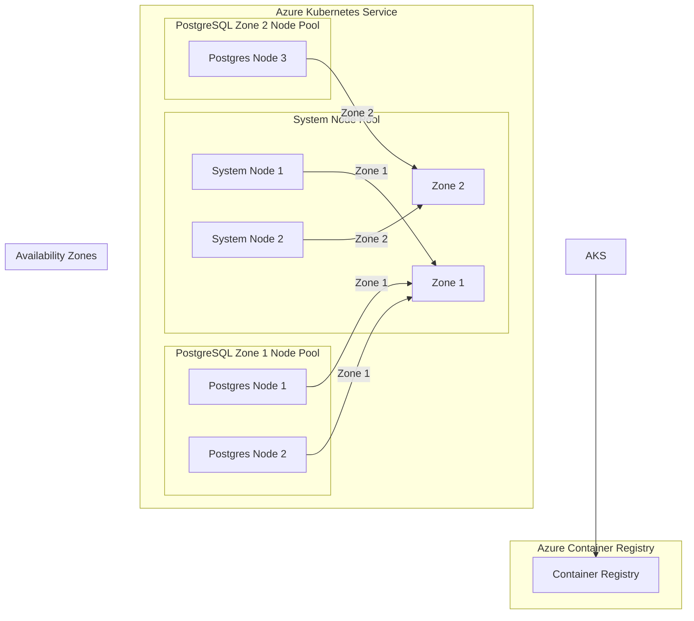

# AKS Zone-Pinned Infrastructure

This repository contains Terraform configurations for deploying an Azure Kubernetes Service (AKS) cluster with zone-pinned node pools, specifically designed for running PostgreSQL workloads with high availability across availability zones.

## Architecture Overview



## Infrastructure Components

### 1. AKS Cluster
- **Kubernetes Version**: 1.30
- **RBAC**: Enabled for enhanced security
- **Local Accounts**: Enabled for direct cluster access
- **Network Plugin**: Azure CNI

### 2. Node Pools

#### System Node Pool
- **Purpose**: System workloads and critical cluster components
- **Node Count**: 2 nodes
- **Distribution**: 1 node in Zone 1, 1 node in Zone 2
- **VM Size**: Standard_DS2_v2
- **OS**: Azure Linux

#### PostgreSQL Zone 1 Node Pool (pgzone1)
- **Purpose**: Primary PostgreSQL nodes
- **Node Count**: 2 nodes
- **Distribution**: Both nodes in Zone 1
- **VM Size**: Standard_DS2_v2
- **OS**: Azure Linux
- **Upgrade Settings**:
  - Max Surge: 25% (allows scaling up to 3 nodes during upgrades)
  - Drain Timeout: 30 minutes
  - Node Soak Duration: 5 minutes

#### PostgreSQL Zone 2 Node Pool (pgzone2)
- **Purpose**: Secondary PostgreSQL nodes
- **Node Count**: 1 node
- **Distribution**: Single node in Zone 2
- **VM Size**: Standard_DS2_v2
- **OS**: Azure Linux
- **Upgrade Settings**:
  - Max Surge: 25% (allows scaling up to 2 nodes during upgrades)
  - Drain Timeout: 30 minutes
  - Node Soak Duration: 5 minutes

### 3. Azure Container Registry
- **SKU**: Basic
- **Admin Access**: Enabled
- **Identity**: System-assigned managed identity
- **Network**: Public access with Azure services bypass

## Configuration Details

### Zone Distribution
The infrastructure is designed with a specific zone distribution to ensure high availability:
- Zone 1: Contains 3 nodes (2 PostgreSQL + 1 System)
- Zone 2: Contains 2 nodes (1 PostgreSQL + 1 System)

This distribution ensures:
1. No single zone failure can take down the entire cluster
2. PostgreSQL nodes are primarily in Zone 1 with a secondary node in Zone 2
3. System workloads are distributed across zones

### Upgrade Strategy
The node pools are configured with specific upgrade settings to maintain availability:
- **Max Surge**: 25% of node count
  - pgzone1: Can scale up to 3 nodes during upgrades
  - pgzone2: Can scale up to 2 nodes during upgrades
- **Drain Timeout**: 30 minutes
  - Allows pods to gracefully terminate
  - Ensures data consistency during node replacement
- **Node Soak Duration**: 5 minutes
  - Verifies new nodes are functioning correctly
  - Prevents rapid consecutive upgrades

### Security Configuration
1. **RBAC**: Enabled for fine-grained access control
2. **Local Accounts**: Enabled for direct cluster access
3. **Managed Identities**: Used for AKS and ACR
4. **Role Assignments**:
   - AKS has AcrPull and AcrPush roles for ACR
   - ACR has Owner role for self-management

## Deployment and Verification

The repository includes a `run.sh` script that:
1. Verifies prerequisites
2. Initializes Terraform
3. Deploys the infrastructure
4. Verifies node distribution
5. Checks node readiness
6. Validates zone labels
7. Ensures proper node counts

## Usage

1. Clone the repository
2. Ensure Azure CLI and Terraform are installed
3. Authenticate with Azure:
   ```bash
   az login
   ```
4. Run the deployment:
   ```bash
   ./run.sh
   ```

## Cleanup

The `run.sh` script includes an optional cleanup step that can destroy the infrastructure when prompted. This is useful for development and testing environments.

## Notes

- The infrastructure is designed for development/testing purposes
- For production use, consider:
  - Upgrading ACR to Standard SKU
  - Implementing network policies
  - Adding monitoring and logging
  - Configuring backup strategies
  - Implementing proper secret management 